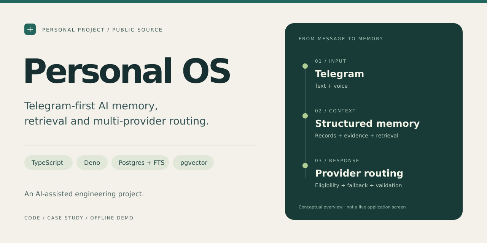
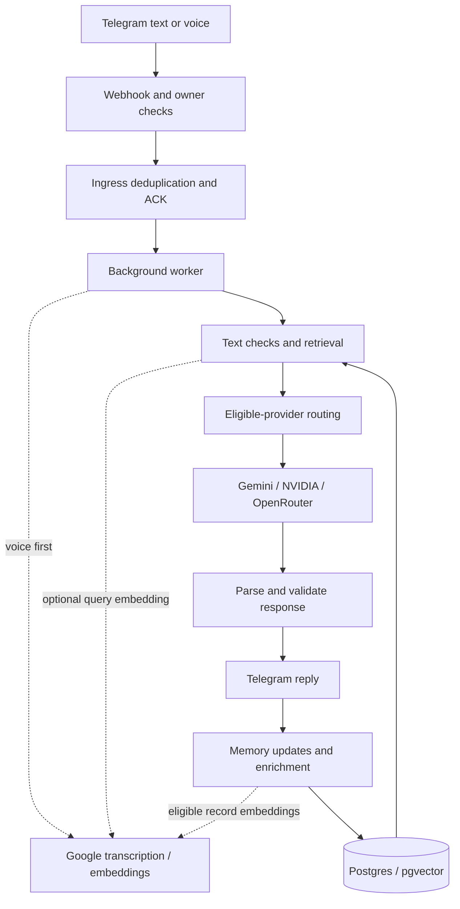

# Personal OS

Telegram-first AI memory, retrieval and multi-provider routing.



Personal OS is a single-user assistant that turns Telegram messages into a conversation with persistent, structured memory. It separates current priorities from durable records and historical evidence, retrieves a bounded amount of context, and routes structured responses through Google Gemini, NVIDIA hosted NIM or OpenRouter.

This is the sanitized public codebase, version **1.3.2**. It is an AI-assisted learning project with implemented integrations and explicit limitations, not a hosted public service or a claim of production readiness. The repository contains code and example data, not an owner's live memory or credentials.

[Case study](docs/PORTFOLIO_CASE_STUDY.md) · [Safe demo](docs/DEMO_GUIDE.md) · [Technical guide](docs/TECHNICAL_GUIDE.md) · [Roadmap](docs/ROADMAP.md) · [Security policy](SECURITY.md)

## Why I built it

I wanted a way to keep useful context across conversations without pasting entire chat archives into every prompt. That raised a more interesting engineering problem: what should become memory, how should it be retrieved, and what should happen when a model or provider fails?

I developed the project with substantial help from ChatGPT and GitHub Copilot. My hands-on work included defining requirements, making product decisions, working through debugging with AI assistance, running checks and managing the sanitized public release. The [case study](docs/PORTFOLIO_CASE_STUDY.md#ownership-and-learning) separates that experience from skills I am still developing.

## What is in the code

| Capability | Implementation |
| --- | --- |
| Telegram text and voice | Deno Edge Function, webhook-secret check and owner-account gate |
| Duplicate-update handling | Unique ingress records and early acknowledgement before background work |
| Structured memory | Typed records, current state, source links, historical evidence and entity relationships |
| Hybrid retrieval | Entity/exact matching, PostgreSQL full-text search and optional pgvector similarity |
| Multi-provider responses | Three registered adapters, privacy eligibility, configured quota guards, circuits and bounded fallback |
| Response validation | JSON parsing and shared checks for required fields, nested types and enums |
| Diagnostics | Model-run metadata, routing decisions and database audit scripts |
| Repository checks | Node helper tests, Deno schema tests, syntax/type checks and a configurable public-file audit |

These describe implementation, not measured accuracy, latency, cost or uptime.

## Architecture



The reply is sent before memory enrichment finishes. This diagram groups steps for readability; it does not imply transactional or exactly-once processing. See the [architecture graphic](assets/personal-os-architecture.svg) and [request walkthrough](docs/TECHNICAL_GUIDE.md#request-walkthrough).

Google transcription and embeddings are separate from conversational provider selection. Voice transcription occurs before text-level checks; query embedding can occur before final route-sensitivity classification. The system is not local-only, and routing policy is not a blanket guarantee that sensitive data never reaches a cloud provider.

## Run a safe local check

Use Node.js 22, as configured in CI, and Git. Run from a checkout of this repository. These commands need no credentials or dependency installation:

```bash
node --test tests/lib.test.mjs
node scripts/check-syntax.mjs
node scripts/audit-public.mjs
node docs/demo/offline-demo.mjs
```

If npm is available, the first three commands have these aliases:

```bash
npm test
npm run check:syntax
npm run audit:public
```

The offline demo uses synthetic data and real helper functions. It demonstrates canonical-key normalization and inspects the example import; it does not simulate a successful LLM response.

For the Deno checks, install Deno 2 separately:

```bash
deno test supabase/functions/_shared/schema-validation.deno.ts
deno check supabase/functions/telegram/index.ts
```

The schema tests need no API credentials. The type check may download imported modules. CI additionally runs `npm ci` using the existing lockfile. That installation is not required for the credential-free demo.

## Memory and privacy boundaries

| Layer or control | Meaning |
| --- | --- |
| Current state | Compact current priorities, included when the planner considers them relevant |
| Canonical records | Durable typed records with source references; model extraction can still be wrong |
| Historical evidence | Bounded source excerpts, distinguished from current confirmed state |
| Quarantine | Source role/scope excluded by the hybrid source-retrieval SQL |
| `/nostore` | Suppresses raw user/assistant text persistence; metadata and memory operations may still be written |
| Public-file audit | Checks tracked paths, known secret patterns and optionally configured private terms; not a security certification |

Keep real configuration in ignored local files or your deployment's secret store. Never upload live conversation history, exported memory or credentials as demo material. Use an isolated test bot and test database for any live demonstration.

## Commands in the bot

| Command | Behavior |
| --- | --- |
| `/help` | Show commands without conversational inference |
| `/state` | Read current state without conversational inference |
| `/fast <message>` | Request a latency-oriented route and smaller retrieval scope |
| `/deep <message>` | Request deeper retrieval and a reasoning-oriented route |
| `/capture <message>` | Ask for a concise response with durable extraction when appropriate |
| `/nostore <message>` | Process without persisting raw user/assistant text |

Command parsing accepts one leading mode; do not assume modes can be stacked.

## Technology choices

TypeScript and Deno run the Telegram Edge Function. Supabase Postgres stores records, provenance, entities and route state; pgvector complements full-text retrieval. Node.js scripts handle imports, checks and diagnostics. GitHub Actions runs the verification workflow.

Provider adapters share a structured-response interface. Model names, quotas and availability are account-dependent configuration, not promises made by this README. The [technical guide](docs/TECHNICAL_GUIDE.md#provider-routing) explains the defaults found in this version.

## Known limits and next work

- The suite is small: seven Node helper tests and three Deno schema tests. It does not establish end-to-end bot reliability, retrieval quality or privacy correctness.
- Sensitivity classification uses heuristics and model output. Voice, embeddings, logs and memory writes need separate review.
- `EdgeRuntime.waitUntil` is background execution, not a durable job queue with automatic recovery.
- Schema checks verify part of the response structure, not factual truth or every memory operation's safety.
- Quality/speed scores and provider-share targets are configured heuristics. No comparative benchmark is published.
- The service-role backend and single-owner design have not been validated as a multi-tenant application.

The [roadmap](docs/ROADMAP.md) prioritizes mocked integration tests, a small retrieval evaluation set and clearer data-lifecycle guarantees before additional features.

## Explore the project

- [Portfolio case study](docs/PORTFOLIO_CASE_STUDY.md): decisions, trade-offs and development lessons.
- [Technical guide](docs/TECHNICAL_GUIDE.md): source map, controls and setup boundaries.
- [Demo guide](docs/DEMO_GUIDE.md): offline walkthrough and an optional synthetic live-demo checklist.
- [LinkedIn kit](docs/LINKEDIN.md): editable project entry, post drafts and publication checklist.
- [Visual assets](assets/README.md): editable SVGs and upload-ready PNGs.
- [Changelog](CHANGELOG.md): historical notes; previous provider-validation statements are not current availability guarantees.

Licensed under the [MIT license](LICENSE). Report security concerns through [SECURITY.md](SECURITY.md).
